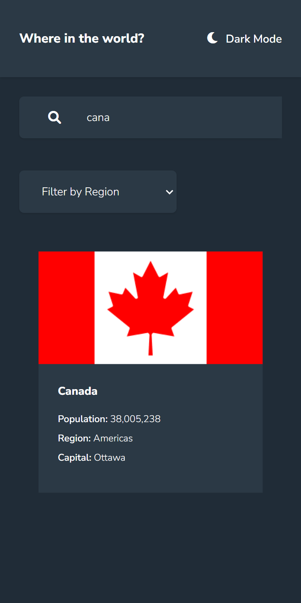

# Frontend Mentor - REST Countries API with color theme switcher solution

This is a solution to the [REST Countries API with color theme switcher challenge on Frontend Mentor](https://www.frontendmentor.io/challenges/rest-countries-api-with-color-theme-switcher-5cacc469fec04111f7b848ca). Frontend Mentor challenges help you improve your coding skills by building realistic projects. 

## Table of contents

- [Overview](#overview)
  - [The challenge](#the-challenge)
  - [Screenshot](#screenshot)
- [My process](#my-process)
  - [Built with](#built-with)
  - [What I learned](#what-i-learned)
  - [Useful resources](#useful-resources)
- [Author](#author)
- [Acknowledgments](#acknowledgments)

## Overview

### The challenge

Users should be able to:

- See all countries from the API on the homepage
- Search for a country using an `input` field
- Filter countries by region
- Click on a country to see more detailed information on a separate page
- Click through to the border countries on the detail page
- Toggle the color scheme between light and dark mode *(optional)*

### Screenshot

## My process

### Built with

- [React](https://reactjs.org/) - JS library
- [TypeScript](https://www.typescriptlang.org/) - JS Superset
- [Tailwind CSS](https://tailwindcss.com/) - Styles
- [REST Countries API](https://restcountries.com) - Countries API

### What I learned

I learned a ton on this project, especially related to using React Router, mapping over objects, multiple levels of interfaces, and filtering data. It also had some nice layout challenges.

### Useful resources

- [A guide to using React Router v6 in React apps](https://blog.logrocket.com/react-router-v6/) - Practical overview of using React Router v6 and the changes from previous versions.
- [How to Create Recursive Routes with React Router](https://ui.dev/react-router-recursive-paths) - This article helped with displaying Links based on relative data, in this case bordering countries.
- [TypeScript map over Object keys and values: Element implicitly has an 'any' type](https://stackoverflow.com/questions/62445521/typescript-map-over-object-keys-and-values-element-implicitly-has-an-any-type) - This question and answer pointed me in the right direction using Object.keys to find and iterate over the unknown properties of the data objects.

## Author

- Website - [Justin Fowler Art](https://www.justinfowlerart.com)